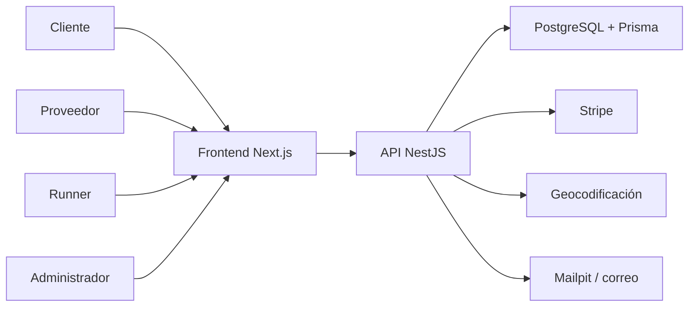
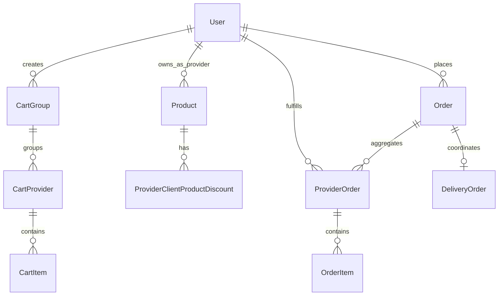

# Mecerka

- GitHub: https://github.com/p1sci5k3y/Mecerka/
- Despliegue: https://mecerka.me
- Despliegue demo: https://demo.mecerka.me
- Credenciales demo:
****    admin.demo@local.test / DemoPass123! ****
****    provider.demo@local.test / DemoPass123! ****
****    provider2.demo@local.test / DemoPass123! ****
****    runner.demo@local.test / DemoPass123! ****
****    runner2.demo@local.test / DemoPass123! ****
****    user.demo@local.test / DemoPass123! ****
****    user2.demo@local.test / DemoPass123! ****
- Slides: [Pendiente: URL de trabajo o edición de las slides]


## Descripción general

Mecerka es una plataforma web de comercio local orientada a operar dentro de una misma ciudad. El repositorio implementa un MVP funcional con arquitectura separada de frontend y backend, pensado para conectar cuatro perfiles de uso verificables en código: `CLIENT`, `PROVIDER`, `RUNNER` y `ADMIN`.

El objetivo observable del sistema es resolver un flujo completo de compra local en el que una persona usuaria pueda descubrir productos, construir una cesta, confirmar un pedido con entrega geolocalizada y gestionar el pago de forma compatible con un escenario multiproveedor. La propuesta de valor real del proyecto no es un “marketplace” genérico, sino un circuito de comercio de proximidad con estas características implementadas:

- pedido raíz con varios `ProviderOrder[]` dentro de una misma ciudad;
- validación de cobertura logística en backend a partir de dirección geocodificada y radio efectivo por proveedor;
- pagos separados por comercio;
- pago del runner modelado de forma explícita y separada;
- control de acceso por rol, MFA en rutas sensibles y escalado de privilegios mediante solicitud formal de rol.

La diferencia principal frente a una tienda monovendedor clásica, según el estado actual del código, es que el flujo oficial de compra no se apoya en un único pedido simple, sino en una arquitectura de carrito backend y checkout multiproveedor con subpedidos por comercio. Al mismo tiempo, el repositorio sigue presentándose honestamente como un MVP: parte de la superficie pública se ha reducido o marcado como no disponible cuando no existe un soporte funcional completo.

El alcance real del MVP, verificable en frontend, backend, configuración y tests, incluye:

- registro público restringido a cuentas `CLIENT`;
- autenticación con verificación por correo, recuperación de contraseña y soporte MFA;
- solicitud autenticada de rol para `PROVIDER` y `RUNNER`;
- catálogo de productos y detalle de producto;
- carrito oficial en backend;
- checkout oficial con dirección obligatoria, geocodificación backend y validación de cobertura;
- pagos separados por `ProviderOrder`;
- bloque separado de pago del runner;
- paneles operativos básicos para proveedor, runner y administración;
- tests backend unitarios, de integración y end-to-end con infraestructura efímera.

Desde el punto de vista de análisis y diseño, el proyecto se materializa como un monolito modular con inspiración DDD. No implementa DDD táctico completo, pero sí una separación clara entre transporte, validación, servicios de aplicación y persistencia, con Prisma como capa de acceso a datos y PostgreSQL como base operativa.



## Stack tecnológico

### Tecnologías verificadas en el repositorio

| Capa | Tecnologías verificadas | Evidencia principal |
| --- | --- | --- |
| Frontend | Next.js 16, React 19, TypeScript, next-intl, React Hook Form, Zod, Tailwind CSS, Stripe.js, Leaflet, socket.io-client | [`frontend/package.json`](frontend/package.json) |
| Backend | NestJS 11, TypeScript, Passport JWT, Argon2, class-validator, class-transformer, Nodemailer, Socket.IO, Stripe SDK | [`backend/package.json`](backend/package.json) |
| Persistencia | PostgreSQL 15 + Prisma ORM | [`backend/prisma/schema.prisma`](backend/prisma/schema.prisma), [`docker-compose.yml`](docker-compose.yml) |
| Infraestructura local | Docker Compose, Dockerfiles separados para frontend y backend, Mailpit | [`docker-compose.yml`](docker-compose.yml), [`frontend/Dockerfile`](frontend/Dockerfile) |
| Testing backend | Jest, Supertest, Testcontainers, Prisma migrations en entorno efímero | [`backend/package.json`](backend/package.json), [`docs/testing.md`](docs/testing.md) |
| Testing frontend | Vitest, Testing Library, coverage V8, Playwright | [`frontend/package.json`](frontend/package.json), [`frontend/__tests__`](frontend/__tests__), [`frontend/e2e`](frontend/e2e) |
| Calidad y automatización | ESLint, Prettier, Husky, lint-staged | [`package.json`](package.json), [`backend/.prettierrc`](backend/.prettierrc), [`.husky`](.husky) |
| CI/CD y seguridad | GitHub Actions, CodeQL, Trivy, Gitleaks, OWASP Dependency Check, despliegue automatizado a AWS EC2 | [`.github/workflows/ci.yml`](.github/workflows/ci.yml), [`.github/workflows/codeql.yml`](.github/workflows/codeql.yml), [`.github/workflows/deploy.yml`](.github/workflows/deploy.yml) |

### Encaje del stack con el proyecto

El stack encaja con el objetivo del proyecto por varias razones observables en el propio código:

- **TypeScript en frontend y backend** favorece contratos tipados entre vistas, servicios y DTOs.
- **NestJS** facilita una arquitectura modular por capacidades de negocio (`auth`, `cart`, `orders`, `payments`, `delivery`, `users`, etc.).
- **Prisma + PostgreSQL** permiten modelar con claridad entidades de dominio como `Order`, `ProviderOrder`, `DeliveryOrder`, `CartGroup` o `ProviderClientProductDiscount`.
- **Docker Compose** ofrece un entorno local reproducible con base de datos, backend, frontend y correo de pruebas.
- **Stripe** se integra como proveedor de sesiones de pago por comercio y para el runner, en línea con el modelo oficial del repositorio.

### Seguridad, buenas prácticas y controles verificables

Sin constituir módulos independientes de “seguridad”, el repositorio implementa controles relevantes y verificables:

- autenticación JWT con contraseñas hasheadas con Argon2;
- verificación de correo antes del login;
- MFA disponible y exigible mediante `MfaCompleteGuard` en rutas sensibles;
- autorización por rol con `RolesGuard` y validación adicional de propiedad del recurso en servicios;
- validación global de DTOs con `whitelist: true`, `forbidNonWhitelisted: true` y `transform: true`;
- `helmet`, `cookie-parser`, CORS con allowlist e `Idempotency-Key` explícita;
- limitación de peticiones con `@nestjs/throttler`;
- minimización de datos fiscales mediante hash HMAC y `FISCAL_PEPPER`;
- logging estructurado con redacción de campos sensibles;
- control de concurrencia para asignación de roles privilegiados;
- workflows de CI con análisis estático y escaneos de seguridad.

## Instalación y ejecución

### Requisitos previos

Según la configuración y la documentación del repositorio, para la ejecución local son necesarios:

- Docker y Docker Compose;
- Node.js y npm si se quieren ejecutar comandos manuales de frontend/backend fuera de contenedores.

### Configuración del entorno local

El repositorio incluye un bootstrap explícito de secretos y variables de entorno:

```bash
make setup
```

Este comando ejecuta [`scripts/bootstrap-env.sh`](scripts/bootstrap-env.sh) y genera un `.env` local coherente con [`.env.example`](.env.example). Entre otras variables, inicializa:

- `POSTGRES_PASSWORD`
- `DATABASE_URL`
- `JWT_SECRET`
- `JWT_SECRET_CURRENT`
- `FISCAL_PEPPER`

Además, deja `DEMO_MODE=false` por defecto, por lo que el modo demo es opt-in.

### Ejecución recomendada con Docker Compose

La ruta operativa principal para levantar el sistema es:

```bash
docker compose up -d --build
```

El `docker-compose.yml` actual levanta:

- `postgres`
- `backend`
- `frontend`
- `mailpit`

El backend ejecuta automáticamente:

```bash
npx prisma generate && npx prisma migrate deploy && node dist/src/main
```

Además, el proyecto incorpora un *base seed* para datos estructurales del marketplace, documentado en [`docs/demo-environment.md`](docs/demo-environment.md) y soportado por el módulo [`seed`](backend/src/seed).

Comprobaciones básicas de arranque:

```bash
curl -fsS http://localhost:3000/health
docker compose ps
```

URLs locales por defecto:

- frontend: `http://localhost:3001`
- backend: `http://localhost:3000`
- Mailpit: `http://localhost:8025`

### Ejecución manual por componentes

Aunque el flujo recomendado es Docker Compose, el repositorio también permite ejecución manual utilizando los scripts reales de cada workspace.

Backend:

```bash
cd backend
npm install
npx prisma generate
npx prisma migrate deploy
npm run start:dev
```

Frontend:

```bash
cd frontend
npm install
npm run dev
```

Esta vía requiere una base de datos PostgreSQL accesible y variables de entorno configuradas de forma compatible con [`backend/src/config/env.validation.ts`](backend/src/config/env.validation.ts).

### Modo demo

La documentación y la configuración indican que el modo demo existe, pero no está activado por defecto. Para habilitarlo hay que editar `.env` y establecer:

```env
DEMO_MODE=true
DEMO_PASSWORD=elige-una-contraseña-demo
```

Después:

```bash
docker compose up -d --build
```

Según [`docs/demo-environment.md`](docs/demo-environment.md), este modo habilita dataset demo y endpoints administrativos de reseteo/seed, pero no debe considerarse comportamiento por defecto ni apropiado para producción.

### Comandos de validación y test

En la raíz del repositorio:

```bash
npm run lint:all
npm run type-check:all
npm run test:ci
```

En backend:

```bash
cd backend
npm run lint
npm run type-check
npm run test
npm run test:e2e
npm run build
```

En frontend:

```bash
cd frontend
npm run lint
npm run type-check
npm run test
npm run test:cov
npm run build
npm run test:e2e
npm run test:e2e:full
```

Observaciones fieles al estado actual del repositorio:

- la validación automatizada fuerte sigue concentrada en backend;
- el frontend ya cuenta con suite unitaria en Vitest y cobertura real en [`frontend/coverage`](frontend/coverage);
- la suite backend usa Testcontainers y PostgreSQL efímero, tal como documenta [`docs/testing.md`](docs/testing.md).

## Estado Verificable Actual

Las siguientes cifras están recalculadas sobre este árbol de trabajo en fecha **27 de marzo de 2026**:

| Área | Resultado actual | Evidencia |
| --- | --- | --- |
| Frontend unitario | `37 files`, `132 tests`, OK | `cd frontend && npm run test:cov` |
| Frontend coverage | `37.98%` lines, `37.99%` statements, `44.32%` branches, `39.71%` functions | [`frontend/coverage/coverage-summary.json`](frontend/coverage/coverage-summary.json) |
| Backend unit/integration | `112 suites`, `1206 tests`, OK | `cd backend && npm run test:cov -- --runInBand` |
| Backend coverage | `92.03%` lines, `91.68%` statements, `84.64%` branches, `90.69%` functions | [`backend/coverage/coverage-summary.json`](backend/coverage/coverage-summary.json) |
| Demo pública | `runtime-config` correcto, login demo operativo y Stripe dummy activo | [demo.mecerka.me](https://demo.mecerka.me), [runtime-config](https://demo.mecerka.me/runtime-config) |

Lectura honesta:

- el backend está muy por encima del umbral global del proyecto;
- el frontend ya tiene una base razonable de cobertura en flujos críticos, pero sigue acumulando deuda en `login`, `register`, `reset-password`, `admin/*` y gran parte de `components/ui`;
- la demo pública ya usa la misma app y la misma API del circuito real, con clave pública Stripe dummy y flujo demo de pago soportado por el backend.

## Estructuración

### Visión general de la estructura

El repositorio se organiza en varios bloques claramente diferenciados:

```text
TFM/
├── backend/
│   ├── prisma/
│   │   ├── migrations/
│   │   ├── schema.prisma
│   │   └── seed.ts
│   ├── src/
│   │   ├── admin/
│   │   ├── auth/
│   │   ├── cart/
│   │   ├── categories/
│   │   ├── cities/
│   │   ├── delivery/
│   │   ├── demo/
│   │   ├── email/
│   │   ├── geocoding/
│   │   ├── observability/
│   │   ├── orders/
│   │   ├── payments/
│   │   ├── prisma/
│   │   ├── products/
│   │   ├── providers/
│   │   ├── refunds/
│   │   ├── risk/
│   │   ├── runner/
│   │   ├── seed/
│   │   ├── support/
│   │   └── users/
│   └── test/
├── frontend/
│   ├── app/
│   │   └── [locale]/
│   │       ├── admin/
│   │       ├── auth/
│   │       ├── cart/
│   │       ├── dashboard/
│   │       ├── login/
│   │       ├── mfa/
│   │       ├── orders/
│   │       ├── products/
│   │       ├── profile/
│   │       ├── provider/
│   │       ├── register/
│   │       ├── runner/
│   │       └── verify/
│   ├── __tests__/
│   ├── components/
│   ├── contexts/
│   ├── coverage/
│   ├── e2e/
│   ├── lib/
│   └── messages/
├── docs/
├── doc/adr/
├── infrastructure/
├── scripts/
└── .github/workflows/
```

### Organización del backend

El backend, definido en [`backend/src/app.module.ts`](backend/src/app.module.ts), responde a un patrón de monolito modular. Cada capacidad de negocio tiene su propio módulo NestJS y normalmente su combinación de:

- controlador;
- servicio;
- DTOs;
- tests unitarios o de integración.

Los módulos más relevantes para el flujo oficial de compra son:

- `auth`: registro, login, verificación de correo, MFA y recuperación de contraseña;
- `users`: solicitud de rol y configuración de PIN;
- `products`: catálogo, CRUD de productos y descuentos proveedor→cliente;
- `cart`: carrito backend oficial;
- `orders`: checkout oficial y pedido raíz con `ProviderOrder[]`;
- `payments`: sesiones de pago por proveedor y agregado de pagos del pedido;
- `delivery`: creación de `DeliveryOrder`, asignación de runner, tracking y pago del runner.

Otros módulos presentes y verificables:

- `admin`, `cities`, `categories`
- `providers`, `runner`
- `support`, `refunds`
- `risk`, `observability`
- `demo`, `seed`
- `geocoding`, `email`

El arranque del backend distingue entre dos estrategias de inicialización:

- **base seed**, orientado a asegurar datos estructurales como ciudades y categorías;
- **demo seed**, activable solo con `DEMO_MODE=true`, para generar usuarios y datos operativos de demostración.

### Organización del frontend

El frontend usa App Router de Next.js y está organizado alrededor de rutas localizadas (`[locale]`) y capas auxiliares:

- [`app`](frontend/app): páginas y rutas;
- [`components`](frontend/components): piezas de UI reutilizables;
- [`contexts`](frontend/contexts): estado compartido de autenticación y carrito;
- [`lib`](frontend/lib): adaptadores HTTP, tipos y servicios cliente;
- [`messages`](frontend/messages): internacionalización;
- [`__tests__`](frontend/__tests__): tests unitarios y de experiencia con Vitest;
- [`e2e`](frontend/e2e): automatización browser con Playwright;
- [`coverage`](frontend/coverage): artefactos de cobertura HTML y resumen JSON.

El frontend actual está alineado con los contratos oficiales del backend en puntos clave del MVP:

- registro público solo como `CLIENT`;
- solicitud de rol separada desde perfil;
- carrito backend como fuente de verdad autenticada;
- checkout oficial con resumen de pagos por comercio;
- bloque del runner separado en la UI de pagos.

### Modelo de datos observable

El esquema Prisma define un dominio suficientemente expresivo para el MVP. Entre las entidades más importantes están:

- `User`, `Provider`, `RunnerProfile`
- `City`, `Category`, `Product`
- `ProviderClientProductDiscount`
- `CartGroup`, `CartProvider`, `CartItem`
- `Order`, `ProviderOrder`, `OrderItem`
- `ProviderPaymentSession`, `DeliveryOrder`
- `StockReservation`

La decisión de diseño más visible en el modelo es que el pedido oficial no es monolítico: un `Order` raíz coordina la experiencia y agrupa varios `ProviderOrder`, cada uno con su subtotal, estado y pago independiente.



### Decisiones de diseño destacables

La estructura actual permite afirmar, sin exagerar, varias buenas prácticas observables:

- separación entre controladores de transporte y servicios de negocio;
- validación fuerte de entrada mediante DTOs;
- persistencia centralizada en Prisma;
- flujos críticos protegidos por transacciones e idempotencia en checkout;
- seguridad en capas con autenticación, MFA, RBAC y comprobación de propiedad;
- documentación técnica adicional en [`docs`](docs) y decisiones en [`doc/adr`](doc/adr).

## Funcionalidades

### Funcionalidades implementadas

#### Autenticación y gestión de acceso

- registro público restringido a cuentas `CLIENT`;
- verificación de correo antes del login;
- inicio de sesión con JWT;
- recuperación y restablecimiento de contraseña;
- configuración y verificación de MFA;
- hidratación de sesión mediante `/auth/me` ajustada al contrato real;
- redirección post-login por rol a la pantalla operativa principal correspondiente.

#### Flujo de cliente

- navegación pública del catálogo y detalle de producto;
- mini-cesta local temporal antes de autenticarse;
- migración de esa mini-cesta al carrito backend oficial al iniciar el flujo autenticado;
- carrito backend oficial con:
  - alta de productos,
  - actualización de cantidad,
  - eliminación de líneas,
  - agrupación por proveedor;
- checkout oficial vía `POST /cart/checkout` con:
  - `cityId`,
  - `deliveryAddress`,
  - `postalCode`,
  - `addressReference` opcional,
  - `discoveryRadiusKm`;
- geocodificación backend y validación de cobertura por proveedor;
- pedido raíz con varios `ProviderOrder[]` dentro de una misma ciudad;
- resumen de pagos por comercio tras el checkout;
- visualización separada del pago del runner;
- centro de `Mis pedidos` con separación entre pedidos pendientes e histórico;
- seguimiento accesible desde dashboard, listado de pedidos y pantalla de pagos;
- centro de `Pagos y tarjetas` en perfil para aclarar el flujo actual y localizar pedidos con cobro pendiente;
- configuración de PIN transaccional;
- solicitud de rol `PROVIDER` o `RUNNER` desde perfil, con validación fiscal y MFA.

#### Flujo de proveedor

- publicación y mantenimiento de productos propios;
- listado de productos del proveedor;
- páginas específicas de gestión de catálogo en frontend;
- importación y exportación de catálogo CSV en backend;
- vista operativa de ventas;
- centro de `Cobros y devoluciones` con visibilidad de Stripe Connect, cobros y refunds ligados a `ProviderOrder`;
- asignación de descuentos proveedor→cliente a nivel de producto:
  - activables/desactivables,
  - acotados a un cliente concreto,
  - sin afectar a otros proveedores del mismo pedido.

#### Flujo de runner

- panel operativo para runner;
- listado de trabajos de reparto disponibles;
- aceptación de trabajo;
- cambio de estado del reparto (`pickup`, `in transit`, `delivered`);
- actualización de ubicación;
- tracking del pedido y del reparto;
- centro financiero para runner con cobros confirmados y cobros pendientes;
- pago del runner modelado como flujo separado.

#### Flujo de administración

- panel administrativo;
- gestión de usuarios;
- concesión administrativa de roles;
- gestión maestra de ciudades y categorías;
- endpoints y módulos de demo protegidos por rol;
- módulos de observabilidad y riesgo protegidos en backend.

#### Pagos y descuentos

- arquitectura oficial de pagos separada por `ProviderOrder`;
- endpoint agregado de pagos del pedido raíz;
- sesión de pago por proveedor;
- bloque separado de pago del runner;
- modo demo de pago fake para comercio y runner cuando la demo publica Stripe dummy;
- descuentos de proveedor a cliente integrados en:
  - carrito backend,
  - checkout oficial,
  - subtotales de `ProviderOrder`,
  - resumen de pagos por proveedor.

### Funcionalidades parciales o acotadas

- **Escaparate público por proveedor**: existe ruta en frontend, pero actualmente se presenta como no disponible y no forma parte del flujo oficial público.
- **Descuentos**: el MVP real soporta descuentos proveedor→cliente por producto. No existe un sistema completo de promociones globales, cupones de plataforma o campañas transversales.
- **Wallet del cliente**: existe pantalla de `Pagos y tarjetas`, pero hoy no hay almacenamiento persistente de tarjetas en perfil; el método de pago sigue introduciéndose por pedido.
- **Refunds visibles en frontend**: provider ya puede ver devoluciones relacionadas con sus pedidos, pero la ejecución y decisión económica siguen descansando en backoffice/admin.
- **Frontend E2E**: el repositorio contiene pruebas Playwright y Vitest, pero la fortaleza principal de validación automatizada sigue hoy en backend. La cobertura browser depende del entorno de demo y del stack operativo.
- **Flujos backend no centrales al MVP visible**: `support`, `refunds`, `risk` y parte de `observability` están implementados en backend, pero no todos cuentan con la misma profundidad de superficie operativa en frontend.

### Funcionalidades legacy o no oficiales

El repositorio conserva compatibilidad parcial con una rama monoproveedor antigua, pero no debe considerarse el flujo principal del sistema. La arquitectura oficial observable y alineada con el frontend actual es:

- carrito backend oficial;
- checkout oficial por `/cart/checkout`;
- pedido raíz con `ProviderOrder[]`;
- pagos por proveedor;
- runner separado como bloque económico y operativo propio.

En consecuencia, el README no presenta como funcionalidad principal:

- el checkout legacy monoproveedor;
- un cobro único centralizado de plataforma;
- descuentos globales de plataforma;
- social login o flujos públicos no respaldados por backend real.
