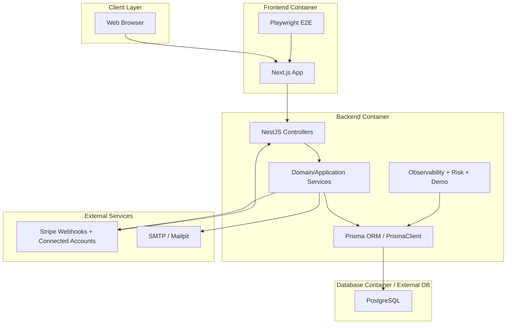

# Container Diagram

```mermaid
flowchart TB
    subgraph "Client Layer"
      browser["Web Browser"]
    end

    subgraph "Frontend Container"
      next["Next.js App"]
      playwright["Playwright E2E"]
    end

    subgraph "Backend Container"
      api["NestJS Controllers"]
      services["Domain/Application Services"]
      prisma["Prisma ORM / PrismaClient"]
      obs["Observability + Risk + Demo"]
    end

    subgraph "Database Container / External DB"
      postgres["PostgreSQL"]
    end

    subgraph "External Services"
      stripe["Stripe Webhooks + Connected Accounts"]
      mail["SMTP / Mailpit"]
    end

    browser --> next
    playwright --> next
    next --> api
    api --> services
    services --> prisma
    obs --> prisma
    prisma --> postgres
    services --> stripe
    stripe --> api
    services --> mail
```
