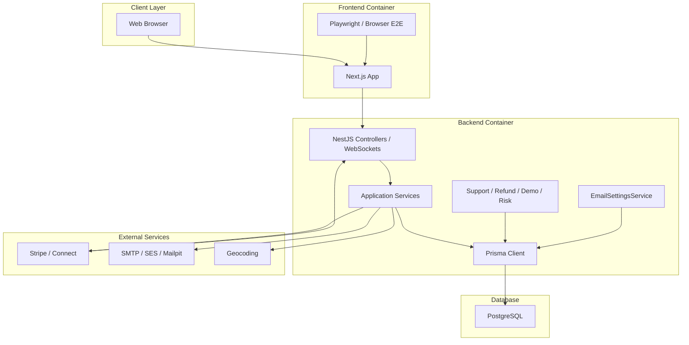

# Container Diagram

```mermaid
flowchart TB
    subgraph "Client Layer"
      browser["Web Browser"]
    end

    subgraph "Frontend Container"
      next["Next.js App"]
      playwright["Playwright / Browser E2E"]
    end

    subgraph "Backend Container"
      api["NestJS Controllers / WebSockets"]
      services["Application Services"]
      prisma["Prisma Client"]
      support["Support / Refund / Demo / Risk"]
      emailcfg["EmailSettingsService"]
    end

    subgraph "Database"
      postgres["PostgreSQL"]
    end

    subgraph "External Services"
      stripe["Stripe / Connect"]
      smtp["SMTP / SES / Mailpit"]
      geo["Geocoding"]
    end

    browser --> next
    playwright --> next
    next --> api
    api --> services
    services --> prisma
    support --> prisma
    emailcfg --> prisma
    prisma --> postgres
    services --> stripe
    stripe --> api
    services --> smtp
    services --> geo
```
