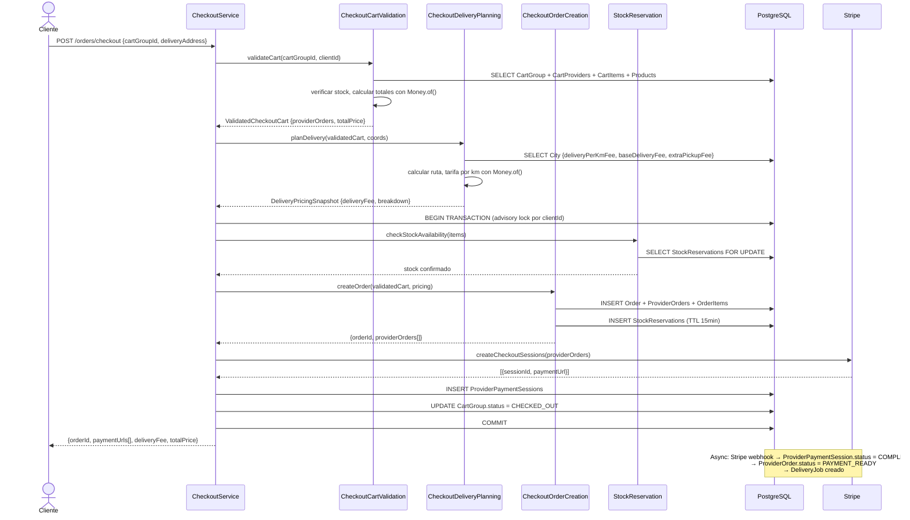

# DFD Nivel 2 — Flujo de Checkout (Proceso 3)

Descomposición del proceso de checkout en sus sub-procesos internos, reflejando la arquitectura real de `CheckoutService` y sus sub-servicios.

```mermaid
sequenceDiagram
    actor Cliente
    participant CS as CheckoutService
    participant CSV as CheckoutCartValidation
    participant CDP as CheckoutDeliveryPlanning
    participant COC as CheckoutOrderCreation
    participant SR as StockReservation
    participant DB as PostgreSQL
    participant Stripe

    Cliente->>CS: POST /orders/checkout {cartGroupId, deliveryAddress}

    CS->>CSV: validateCart(cartGroupId, clientId)
    CSV->>DB: SELECT CartGroup + CartProviders + CartItems + Products
    CSV->>CSV: verificar stock, calcular totales con Money.of()
    CSV-->>CS: ValidatedCheckoutCart {providerOrders, totalPrice}

    CS->>CDP: planDelivery(validatedCart, coords)
    CDP->>DB: SELECT City {deliveryPerKmFee, baseDeliveryFee, extraPickupFee}
    CDP->>CDP: calcular ruta, tarifa por km con Money.of()
    CDP-->>CS: DeliveryPricingSnapshot {deliveryFee, breakdown}

    CS->>DB: BEGIN TRANSACTION (advisory lock por clientId)

    CS->>SR: checkStockAvailability(items)
    SR->>DB: SELECT StockReservations FOR UPDATE
    SR-->>CS: stock confirmado

    CS->>COC: createOrder(validatedCart, pricing)
    COC->>DB: INSERT Order + ProviderOrders + OrderItems
    COC->>DB: INSERT StockReservations (TTL 15min)
    COC-->>CS: {orderId, providerOrders[]}

    CS->>Stripe: createCheckoutSessions(providerOrders)
    Stripe-->>CS: [{sessionId, paymentUrl}]
    CS->>DB: INSERT ProviderPaymentSessions
    CS->>DB: UPDATE CartGroup.status = CHECKED_OUT

    CS->>DB: COMMIT

    CS-->>Cliente: {orderId, paymentUrls[], deliveryFee, totalPrice}

    Note over Stripe,DB: Async: Stripe webhook → ProviderPaymentSession.status = COMPLETED<br/>→ ProviderOrder.status = PAYMENT_READY<br/>→ DeliveryJob creado
```
