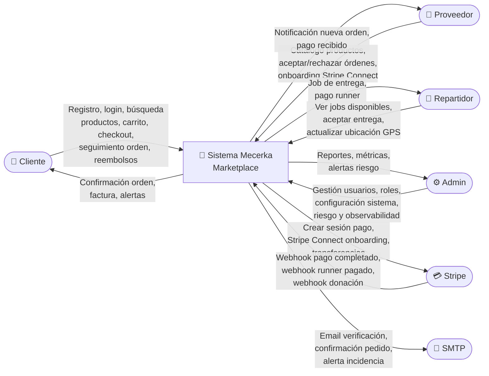

# DFD Nivel 0 — Diagrama de Contexto del Sistema

Muestra el sistema Mecerka como una caja negra con las entidades externas y sus flujos principales.

```mermaid
flowchart LR
    CLIENT(["👤 Cliente"])
    PROVIDER(["🏪 Proveedor"])
    RUNNER(["🛵 Repartidor"])
    ADMIN(["⚙️ Admin"])
    STRIPE(["💳 Stripe"])
    EMAIL(["📧 SMTP"])

    MECERKA["🛒 Sistema Mecerka\nMarketplace"]

    CLIENT -->|"Registro, login, búsqueda\nproductos, carrito, checkout,\nseguimiento orden, reembolsos"| MECERKA
    PROVIDER -->|"Catálogo productos,\naceptar/rechazar órdenes,\nonboarding Stripe Connect"| MECERKA
    RUNNER -->|"Ver jobs disponibles,\naceptar entrega,\nactualizar ubicación GPS"| MECERKA
    ADMIN -->|"Gestión usuarios, roles,\nconfiguración sistema,\nriesgo y observabilidad"| MECERKA

    MECERKA -->|"Confirmación orden,\nfactura, alertas"| CLIENT
    MECERKA -->|"Notificación nueva orden,\npago recibido"| PROVIDER
    MECERKA -->|"Job de entrega,\npago runner"| RUNNER
    MECERKA -->|"Reportes, métricas,\nalertas riesgo"| ADMIN

    MECERKA -->|"Crear sesión pago,\nStripe Connect onboarding,\ntransferencias"| STRIPE
    STRIPE -->|"Webhook pago completado,\nwebhook runner pagado,\nwebhook donación"| MECERKA

    MECERKA -->|"Email verificación,\nconfirmación pedido,\nalerta incidencia"| EMAIL
```
