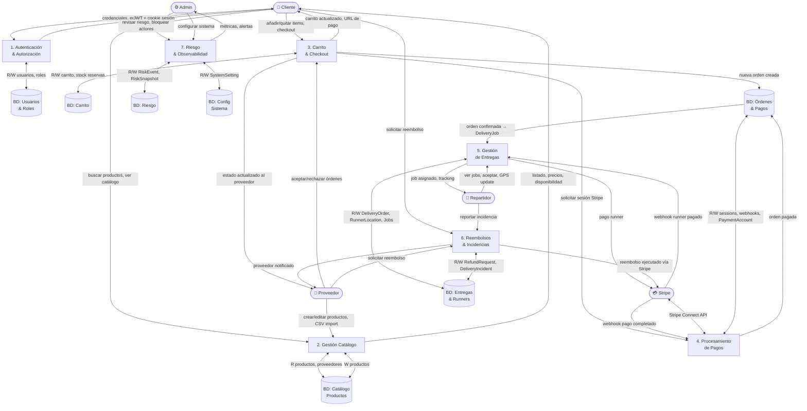

# DFD Nivel 1 — Procesos Principales del Sistema

Descomposición de Mecerka en sus 7 procesos principales con almacenes de datos.

```mermaid
flowchart TD
    %% ─── ACTORES EXTERNOS ───
    CLIENT(["👤 Cliente"])
    PROVIDER(["🏪 Proveedor"])
    RUNNER(["🛵 Repartidor"])
    ADMIN(["⚙️ Admin"])
    STRIPE(["💳 Stripe"])

    %% ─── ALMACENES DE DATOS ───
    DB_USERS[("BD: Usuarios\n& Roles")]
    DB_CATALOG[("BD: Catálogo\nProductos")]
    DB_CART[("BD: Carrito")]
    DB_ORDERS[("BD: Órdenes\n& Pagos")]
    DB_DELIVERY[("BD: Entregas\n& Runners")]
    DB_RISK[("BD: Riesgo")]
    DB_CONFIG[("BD: Config\nSistema")]

    %% ─── PROCESOS ───
    P1["1. Autenticación\n& Autorización"]
    P2["2. Gestión Catálogo"]
    P3["3. Carrito\n& Checkout"]
    P4["4. Procesamiento\nde Pagos"]
    P5["5. Gestión\nde Entregas"]
    P6["6. Reembolsos\n& Incidencias"]
    P7["7. Riesgo\n& Observabilidad"]

    %% ─── FLUJOS: CLIENTE ───
    CLIENT -->|"credenciales, email verify"| P1
    P1 -->|"JWT + cookie sesión"| CLIENT
    P1 <-->|"R/W usuarios, roles"| DB_USERS

    CLIENT -->|"buscar productos, ver catálogo"| P2
    P2 -->|"listado, precios, disponibilidad"| CLIENT
    P2 <-->|"R productos, proveedores"| DB_CATALOG

    CLIENT -->|"añadir/quitar items, checkout"| P3
    P3 -->|"carrito actualizado, URL de pago"| CLIENT
    P3 <-->|"R/W carrito, stock reservas"| DB_CART
    P3 -->|"nueva orden creada"| DB_ORDERS

    %% ─── FLUJOS: PROVEEDOR ───
    PROVIDER -->|"crear/editar productos, CSV import"| P2
    P2 <-->|"W productos"| DB_CATALOG
    PROVIDER -->|"aceptar/rechazar órdenes"| P3
    P3 -->|"estado actualizado al proveedor"| PROVIDER

    %% ─── FLUJOS: PAGOS ───
    P3 -->|"solicitar sesión Stripe"| P4
    P4 <-->|"Stripe Connect API"| STRIPE
    STRIPE -->|"webhook pago completado"| P4
    P4 <-->|"R/W sessions, webhooks, PaymentAccount"| DB_ORDERS
    P4 -->|"orden pagada"| DB_ORDERS

    %% ─── FLUJOS: ENTREGA ───
    DB_ORDERS -->|"orden confirmada → DeliveryJob"| P5
    RUNNER -->|"ver jobs, aceptar, GPS update"| P5
    P5 -->|"job asignado, tracking"| RUNNER
    P5 -->|"pago runner"| STRIPE
    STRIPE -->|"webhook runner pagado"| P5
    P5 <-->|"R/W DeliveryOrder, RunnerLocation, Jobs"| DB_DELIVERY

    %% ─── FLUJOS: REEMBOLSOS ───
    CLIENT -->|"solicitar reembolso"| P6
    PROVIDER -->|"solicitar reembolso"| P6
    RUNNER -->|"reportar incidencia"| P6
    P6 -->|"reembolso ejecutado vía Stripe"| STRIPE
    P6 <-->|"R/W RefundRequest, DeliveryIncident"| DB_DELIVERY
    P6 -->|"proveedor notificado"| PROVIDER

    %% ─── FLUJOS: ADMIN ───
    ADMIN -->|"revisar riesgo, bloquear actores"| P7
    ADMIN -->|"configurar sistema"| P7
    P7 <-->|"R/W RiskEvent, RiskSnapshot"| DB_RISK
    P7 <-->|"R/W SystemSetting"| DB_CONFIG
    P7 -->|"métricas, alertas"| ADMIN
```
