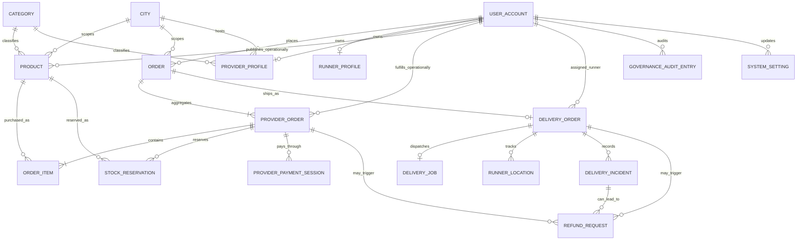

# Domain Model Diagram

```mermaid
erDiagram
    USER_ACCOUNT ||--o{ ORDER : places
    USER_ACCOUNT ||--o| RUNNER_PROFILE : owns
    USER_ACCOUNT ||--o| PROVIDER_PROFILE : owns
    USER_ACCOUNT ||--o{ PRODUCT : publishes_operationally
    USER_ACCOUNT ||--o{ PROVIDER_ORDER : fulfills_operationally
    USER_ACCOUNT ||--o{ DELIVERY_ORDER : assigned_runner
    USER_ACCOUNT ||--o{ GOVERNANCE_AUDIT_ENTRY : audits
    USER_ACCOUNT ||--o{ SYSTEM_SETTING : updates

    CITY ||--o{ PRODUCT : scopes
    CITY ||--o{ ORDER : scopes
    CITY ||--o{ PROVIDER_PROFILE : hosts

    CATEGORY ||--o{ PRODUCT : classifies
    CATEGORY ||--o{ PROVIDER_PROFILE : classifies

    ORDER ||--|{ PROVIDER_ORDER : aggregates
    PROVIDER_ORDER ||--|{ ORDER_ITEM : contains
    PROVIDER_ORDER ||--o{ STOCK_RESERVATION : reserves
    PROVIDER_ORDER ||--o{ PROVIDER_PAYMENT_SESSION : pays_through
    PROVIDER_ORDER ||--o{ REFUND_REQUEST : may_trigger

    ORDER ||--o| DELIVERY_ORDER : ships_as
    DELIVERY_ORDER ||--o| DELIVERY_JOB : dispatches
    DELIVERY_ORDER ||--o{ RUNNER_LOCATION : tracks
    DELIVERY_ORDER ||--o{ DELIVERY_INCIDENT : records
    DELIVERY_ORDER ||--o{ REFUND_REQUEST : may_trigger

    PRODUCT ||--o{ ORDER_ITEM : purchased_as
    PRODUCT ||--o{ STOCK_RESERVATION : reserved_as
    DELIVERY_INCIDENT ||--o{ REFUND_REQUEST : can_lead_to
```
