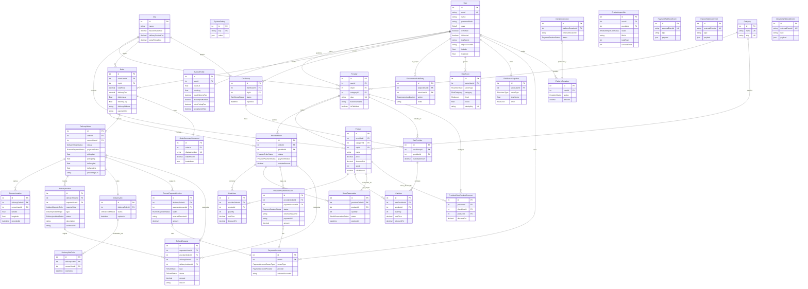

# Diagrama Entidad-Relación — Vista General

Vista consolidada de los 35 modelos del sistema agrupados por dominio.

## Diagrama E/R completo (dominios colapsados)

```mermaid
erDiagram
    %% ─── USUARIOS Y AUTENTICACIÓN ───
    User {
        int id PK
        string email UK
        string name
        string passwordHash
        Role[] roles
        boolean isVerified
        boolean isBlocked
        string totpSecret
        string stripeAccountId
        float latitude
        float longitude
    }
    RunnerProfile {
        int id PK
        int userId FK
        float baseLat
        float baseLng
        decimal baseDeliveryFee
        decimal deliveryPerKmFee
        decimal extraPickupFee
        decimal acceptanceRate
    }
    GovernanceAuditEntry {
        int id PK
        int subjectUserId FK
        int actorUserId FK
        GovernanceAuditAction action
        string notes
    }
    SystemSetting {
        int id PK
        string key UK
        json value
    }

    %% ─── CATÁLOGO ───
    City {
        int id PK
        string name
        decimal baseDeliveryFee
        decimal deliveryPerKmFee
        decimal extraPickupFee
    }
    Category {
        int id PK
        string name UK
        string slug UK
    }
    Provider {
        int id PK
        int userId FK
        int cityId FK
        int categoryId FK
        string slug UK
        string businessName
        boolean isPublished
    }
    Product {
        int id PK
        int providerId FK
        int categoryId FK
        int cityId FK
        string name
        decimal price
        decimal discountPct
        int stock
        boolean isPublished
    }
    ProductImportJob {
        int id PK
        int userId FK
        int providerId FK
        ProductImportJobStatus status
        string fileUrl
        int totalRows
        int successRows
    }
    ProviderClientProductDiscount {
        int id PK
        int providerId FK
        int clientUserId FK
        int productId FK
        decimal discountPct
    }

    %% ─── CARRITO ───
    CartGroup {
        int id PK
        int clientUserId FK
        int cityId FK
        CartGroupStatus status
        datetime expiresAt
    }
    CartProvider {
        int id PK
        int cartGroupId FK
        int providerId FK
        decimal subtotalAmount
    }
    CartItem {
        int id PK
        int cartProviderId FK
        int productId FK
        int quantity
        decimal unitPrice
        decimal discountPct
    }

    %% ─── ÓRDENES ───
    Order {
        int id PK
        int clientUserId FK
        int cityId FK
        decimal totalPrice
        decimal deliveryFee
        float deliveryLat
        float deliveryLng
        string deliveryAddress
        string paymentRef
    }
    ProviderOrder {
        int id PK
        int orderId FK
        int providerId FK
        ProviderOrderStatus status
        ProviderPaymentStatus paymentStatus
        decimal subtotalAmount
    }
    OrderItem {
        int id PK
        int providerOrderId FK
        int productId FK
        int quantity
        decimal unitPrice
        decimal discountPct
    }
    OrderSummaryDocument {
        int id PK
        int orderId FK
        string displayNumber UK
        decimal totalAmount
        json breakdown
    }
    StockReservation {
        int id PK
        int providerOrderId FK
        int productId FK
        int quantity
        StockReservationStatus status
        datetime expiresAt
    }

    %% ─── PAGOS (PROVEEDORES) ───
    PaymentAccount {
        int id PK
        int userId FK
        PaymentAccountOwnerType ownerType
        PaymentAccountProvider provider
        string externalAccountId
    }
    ProviderPaymentSession {
        int id PK
        int providerOrderId FK
        int paymentAccountId FK
        PaymentSessionStatus status
        string externalSessionId
        string paymentUrl
        decimal amount
    }
    PaymentWebhookEvent {
        int id PK
        string externalEventId UK
        string type
        json payload
    }

    %% ─── ENTREGA Y REPARTIDORES ───
    DeliveryOrder {
        int id PK
        int orderId FK
        int runnerUserId FK
        DeliveryOrderStatus status
        RunnerPaymentStatus paymentStatus
        float pickupLat
        float pickupLng
        float deliveryLat
        float deliveryLng
        string proofImageUrl
    }
    RunnerLocation {
        int id PK
        int deliveryOrderId FK
        int runnerUserId FK
        float latitude
        float longitude
        datetime recordedAt
    }
    DeliveryJob {
        int id PK
        int deliveryOrderId FK
        DeliveryJobStatus status
        datetime expiresAt
    }
    DeliveryJobClaim {
        int id PK
        int deliveryJobId FK
        int runnerUserId FK
        datetime claimedAt
    }
    DeliveryIncident {
        int id PK
        int deliveryOrderId FK
        int reporterUserId FK
        IncidentReporterRole reporterRole
        DeliveryIncidentType type
        DeliveryIncidentStatus status
        string description
        string evidenceUrl
    }
    RunnerPaymentSession {
        int id PK
        int deliveryOrderId FK
        int paymentAccountId FK
        RunnerPaymentStatus status
        string externalSessionId
        decimal amount
    }
    RunnerWebhookEvent {
        int id PK
        string externalEventId UK
        string type
        json payload
    }

    %% ─── REEMBOLSOS ───
    RefundRequest {
        int id PK
        int requesterUserId FK
        int providerOrderId FK
        int deliveryOrderId FK
        int deliveryIncidentId FK
        RefundType type
        RefundStatus status
        decimal amount
        string reason
    }

    %% ─── DONACIONES ───
    PlatformDonation {
        int id PK
        int userId FK
        DonationStatus status
        decimal amount
    }
    DonationSession {
        int id PK
        int platformDonationId FK
        string externalSessionId
        PaymentSessionStatus status
    }
    DonationWebhookEvent {
        int id PK
        string externalEventId UK
        string type
        json payload
    }

    %% ─── RIESGO ───
    RiskEvent {
        int id PK
        int actorUserId FK
        RiskActorType actorType
        RiskCategory category
        RiskLevel level
        float score
        string dedupKey UK
    }
    RiskScoreSnapshot {
        int id PK
        int actorUserId FK
        RiskActorType actorType
        float totalScore
        RiskLevel level
    }

    %% ─── RELACIONES ───
    User ||--o{ Provider : "gestiona"
    User ||--o| RunnerProfile : "tiene"
    User ||--o{ Order : "realiza"
    User ||--o{ CartGroup : "posee"
    User ||--o{ GovernanceAuditEntry : "es_sujeto"
    User ||--o{ RiskEvent : "genera"
    User ||--o| RiskScoreSnapshot : "tiene"
    User ||--o{ PaymentAccount : "tiene"
    User ||--o{ PlatformDonation : "realiza"

    City ||--o{ Provider : "alberga"
    City ||--o{ Product : "contiene"
    City ||--o{ Order : "origen"
    City ||--o{ CartGroup : "agrupa"
    Category ||--o{ Provider : "clasifica"
    Category ||--o{ Product : "clasifica"

    Provider ||--o{ Product : "publica"
    Provider ||--o{ ProviderOrder : "recibe"
    Provider ||--o{ CartProvider : "incluido_en"
    Provider ||--o{ ProviderClientProductDiscount : "configura"

    Product ||--o{ OrderItem : "incluido_en"
    Product ||--o{ CartItem : "en_carrito"
    Product ||--o{ StockReservation : "reservado_en"
    Product ||--o{ ProviderClientProductDiscount : "tiene_descuento"

    CartGroup ||--o{ CartProvider : "tiene"
    CartProvider ||--o{ CartItem : "contiene"

    Order ||--o{ ProviderOrder : "incluye"
    Order ||--|| DeliveryOrder : "genera"
    Order ||--o| OrderSummaryDocument : "tiene"

    ProviderOrder ||--o{ OrderItem : "contiene"
    ProviderOrder ||--o{ StockReservation : "reserva"
    ProviderOrder ||--o{ ProviderPaymentSession : "paga_via"
    ProviderOrder ||--o{ RefundRequest : "reembolsa"

    DeliveryOrder ||--o{ RunnerLocation : "rastrea"
    DeliveryOrder ||--o{ DeliveryIncident : "reporta"
    DeliveryOrder ||--|| DeliveryJob : "abre"
    DeliveryOrder ||--o{ RunnerPaymentSession : "paga_via"
    DeliveryOrder ||--o{ RefundRequest : "reembolsa"

    DeliveryJob ||--o{ DeliveryJobClaim : "reclamado_por"
    DeliveryIncident ||--o{ RefundRequest : "origina"

    ProviderPaymentSession }o--|| PaymentAccount : "usa"
    RunnerPaymentSession }o--|| PaymentAccount : "usa"
    DonationSession }o--|| PlatformDonation : "pertenece_a"
```
