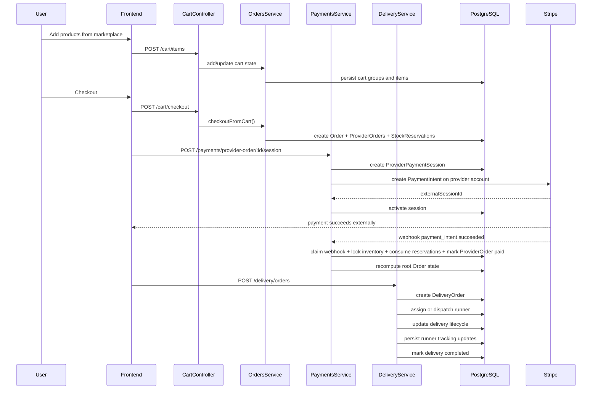

# Order Flow Sequence

```mermaid
sequenceDiagram
    participant U as User
    participant F as Frontend
    participant C as CartController
    participant O as OrdersService
    participant P as PaymentsService
    participant D as DeliveryService
    participant DB as PostgreSQL
    participant S as Stripe

    U->>F: Add products from marketplace
    F->>C: POST /cart/items
    C->>O: add/update cart state
    O->>DB: persist cart groups and items

    U->>F: Checkout
    F->>C: POST /cart/checkout
    C->>O: checkoutFromCart()
    O->>DB: create Order + ProviderOrders + StockReservations

    F->>P: POST /payments/provider-order/:id/session
    P->>DB: create ProviderPaymentSession
    P->>S: create PaymentIntent on provider account
    S-->>P: externalSessionId
    P->>DB: activate session

    S-->>F: payment succeeds externally
    S-->>P: webhook payment_intent.succeeded
    P->>DB: claim webhook + lock inventory + consume reservations + mark ProviderOrder paid
    P->>DB: recompute root Order state

    F->>D: POST /delivery/orders
    D->>DB: create DeliveryOrder
    D->>DB: assign or dispatch runner

    D->>DB: update delivery lifecycle
    D->>DB: persist runner tracking updates
    D->>DB: mark delivery completed
```
