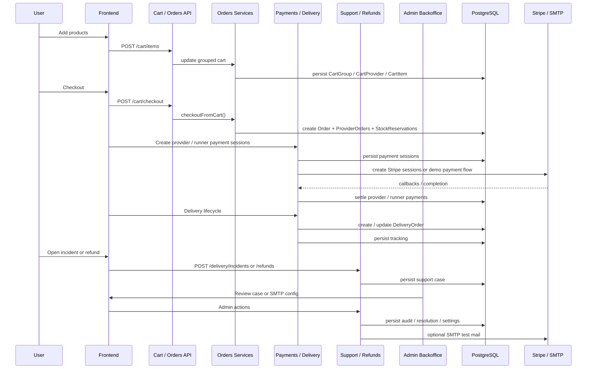

# Order Flow Sequence

```mermaid
sequenceDiagram
    participant U as User
    participant F as Frontend
    participant C as Cart / Orders API
    participant O as Orders Services
    participant P as Payments / Delivery
    participant S as Support / Refunds
    participant A as Admin Backoffice
    participant DB as PostgreSQL
    participant X as Stripe / SMTP

    U->>F: Add products
    F->>C: POST /cart/items
    C->>O: update grouped cart
    O->>DB: persist CartGroup / CartProvider / CartItem

    U->>F: Checkout
    F->>C: POST /cart/checkout
    C->>O: checkoutFromCart()
    O->>DB: create Order + ProviderOrders + StockReservations

    F->>P: Create provider / runner payment sessions
    P->>DB: persist payment sessions
    P->>X: create Stripe sessions or demo payment flow
    X-->>P: callbacks / completion
    P->>DB: settle provider / runner payments

    F->>P: Delivery lifecycle
    P->>DB: create / update DeliveryOrder
    P->>DB: persist tracking

    U->>F: Open incident or refund
    F->>S: POST /delivery/incidents or /refunds
    S->>DB: persist support case

    A->>F: Review case or SMTP config
    F->>S: Admin actions
    S->>DB: persist audit / resolution / settings
    S->>X: optional SMTP test mail
```
