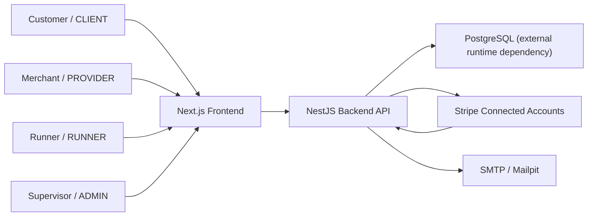

# System Context

```mermaid
flowchart LR
    user["Customer / CLIENT"] --> frontend["Next.js Frontend"]
    provider["Merchant / PROVIDER"] --> frontend
    runner["Runner / RUNNER"] --> frontend
    admin["Supervisor / ADMIN"] --> frontend

    frontend --> backend["NestJS Backend API"]
    backend --> db["PostgreSQL (external runtime dependency)"]
    backend --> stripe["Stripe Connected Accounts"]
    backend --> mail["SMTP / Mailpit"]
    stripe --> backend
```
