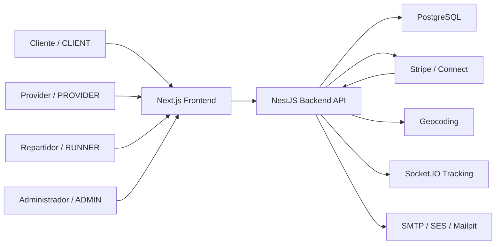

# Contexto Del Sistema

```mermaid
flowchart LR
    user["Cliente / CLIENT"] --> frontend["Next.js Frontend"]
    provider["Provider / PROVIDER"] --> frontend
    runner["Repartidor / RUNNER"] --> frontend
    admin["Administrador / ADMIN"] --> frontend

    frontend --> backend["NestJS Backend API"]
    backend --> db["PostgreSQL"]
    backend --> stripe["Stripe / Connect"]
    backend --> geo["Geocoding"]
    backend --> ws["Socket.IO Tracking"]
    backend --> mail["SMTP / SES / Mailpit"]
    stripe --> backend
```
