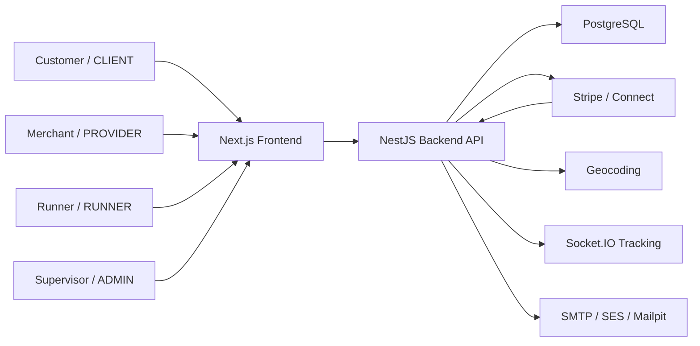

# System Context

```mermaid
flowchart LR
    user["Customer / CLIENT"] --> frontend["Next.js Frontend"]
    provider["Merchant / PROVIDER"] --> frontend
    runner["Runner / RUNNER"] --> frontend
    admin["Supervisor / ADMIN"] --> frontend

    frontend --> backend["NestJS Backend API"]
    backend --> db["PostgreSQL"]
    backend --> stripe["Stripe / Connect"]
    backend --> geo["Geocoding"]
    backend --> ws["Socket.IO Tracking"]
    backend --> mail["SMTP / SES / Mailpit"]
    stripe --> backend
```
